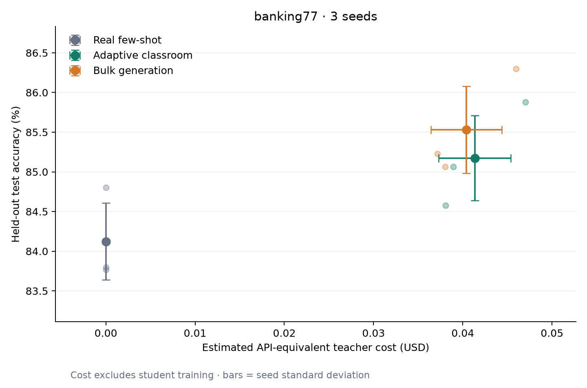

# Banking77: three-seed adaptive teaching comparison

## Finding

With ten real examples per intent, adaptive classroom teaching reached
**85.17% ± 0.54 percentage points** test accuracy. Bulk generation reached
**85.53% ± 0.55**, with its spending cap matched to classroom's realized
estimated spend for each seed. Classroom tied bulk on one seed and lost on
two; its paired difference was **−0.36 ± 0.27 percentage points**.

This recipe did **not** meet the project's go criterion: a classroom mean of
at least 88.2% and an advantage over matched bulk across three seeds. The
measured 20-real-shot reference was 88.21% ± 0.17. This is a negative result
for this teacher, student, budget and stopping recipe. It does not rule out
adaptive teaching under other conditions.

## Measurements

| Arm | Test accuracy (%) | Macro-F1 | ECE, lower is better | Estimated teacher cost (USD) | Retained training examples |
|---|---:|---:|---:|---:|---:|
| Real few-shot | 84.12 ± 0.48 | 0.8409 ± 0.0052 | 0.0315 ± 0.0046 | 0 | 770 |
| Classroom | 85.17 ± 0.54 | 0.8509 ± 0.0057 | 0.0489 ± 0.0048 | 0.0413 ± 0.0040 | 2,014 ± 332 |
| Bulk | 85.53 ± 0.55 | 0.8539 ± 0.0061 | 0.0536 ± 0.0019 | 0.0404 ± 0.0040 | 4,640 ± 346 |

Values are means and population standard deviations across seeds 0, 1 and 2
(ddof=0). Error bars show seed variation, not confidence intervals. All arms
start with the same 770 real examples for a given seed.

Classroom improved on its real-only baseline by 1.05 percentage points; bulk
improved by 1.41. Classroom retained about 57% fewer total training examples
than bulk, but used additional fits and slightly more teacher spend.
Its calibration error was lower than bulk's and higher than the real-only
baseline's. These secondary measurements do not satisfy the accuracy target.

| Seed | Classroom accuracy (%) | Bulk accuracy (%) | Classroom minus bulk (pp) | Classroom estimated spend | Bulk estimated spend | Bulk underspend |
|---|---:|---:|---:|---:|---:|---:|
| 0 | 85.06 | 85.06 | +0.00 | $0.038914 | $0.038024 | $0.000890 |
| 1 | 85.88 | 86.30 | −0.42 | $0.047040 | $0.045974 | $0.001066 |
| 2 | 84.58 | 85.23 | −0.65 | $0.038083 | $0.037131 | $0.000952 |

Bulk used about 2.3–2.5% less than its matched cap because another request's
worst-case reserve would not fit. This gap is part of the comparison.
The chart compares realized arm spending; it is not a budget sweep.

## Fixed design

- **Dataset:** Banking77, 77 intents, 10,003 training and 3,080 official test
  examples; ten real training examples per intent, sampled independently for
  each seed.
- **Student:** SetFit with all-mpnet-base-v2, batch size 16, one epoch,
  20 contrastive iterations, a 2,000-step cap, logistic head C=100.
- **Teacher:** GPT-6 Luna, low reasoning, through the queue provider and saved
  Codex ChatGPT authentication. No paid provider API route was used.
- **Classroom:** ten exam items and ten lesson examples per intent; exam split
  into 385 diagnostic and 385 scoring items. Up to four remedial rounds, at
  least two before improvement-based stopping, up to 15 confusion pairs per
  round, eight examples per side.
- **Budget:** $0.075 API-equivalent estimated cap per classroom arm; each bulk
  cap equals that seed's actual accounted classroom spend. Bulk asks for
  20 examples per call.

Prompts, student settings, budget and stopping rules were fixed before final
evaluation. Teachers receive assigned prompts with training seeds and
diagnostic mistakes; score-half examples and official test data are excluded
from remediation. The scoring half selects the final student. Exact normalized
exam matches are excluded from training.

The full recipe is in
[the config](../configs/pilot_banking77_codex_luna.yaml).
This Luna experiment is separate from historical Claude studies; no historical
missing cell was filled with a Luna result.

## What the loop did

| Seed | Remedial rounds tried | Selected round | Selected scoring accuracy (%) | Stop reason | Classroom runtime (minutes) | Bulk runtime (minutes) |
|---|---:|---:|---:|---|---:|---:|
| 0 | 2 | 1 | 94.55 | No improvement | 34.0 | 19.3 |
| 1 | 4 | 4 | 95.58 | Round limit | 47.6 | 20.1 |
| 2 | 2 | 1 | 95.58 | No improvement | 29.1 | 18.8 |

Remedial examples reached the selected student in all three seeds. Seeds 0
and 2 retained the earlier student when round 2 failed to improve the scoring
exam. Seed 1 continued through all four rounds. Recorded arm runtimes include
queue waiting and evaluation; they are not isolated training benchmarks and
exclude earlier prewarming.

The selected teacher-exam scores were much higher than official test accuracy.
This suggests the teacher exam may be a weak proxy for performance on real
queries. An independent development set or an exam-quality ablation could
investigate that explanation; this experiment does not separate it from
synthetic-data quality or training effects.

## Cost and execution audit

All 1,157 unique teacher requests were saved in 269 batches: 231 exam, 231
lesson, 114 remedial and 581 bulk requests. The final six teacher-arm totals
sum to **$0.245166 in estimated API-equivalent cost**.

Costs use characters / 4 for input and output tokens, priced at the configured
$0.10 / $0.50 per million tokens. They exclude thinking tokens, subscription
usage, student training, hardware and energy. They are not invoices or a claim
that this study cost 25 cents to run. Cached replies are charged at their
original estimated usage for the arm comparison.

Ledger token counts, cached-call counts and cumulative spend were reconciled
with saved results. Per-entry dollar amounts are rounded to six decimal
places; reconciliation uses the token counts and configured rates rather than
summing rounded entries. The earlier seed-0 prewarming ledger segment remains
private and is excluded from the final attempt's totals.

The fixed supervisor completed the main experiment in one attempt, with no
teacher retries or recorded quota errors. It saved completed-fit checkpoints
and atomic replies/results. Quota recovery was checked with simulated failure
cases; this run did not exercise a real quota reset. The initial 18 batches used
isolated Codex subagents, and subsequent batches used isolated CLI sessions.
Both used the same Luna model and low reasoning; the transport change is
recorded in [environment provenance](../results/pilot_banking77_codex_luna/environment.json).

## Reproduce and inspect

Regenerate the tables and chart from the committed aggregate results without
a GPU, dataset download or teacher call:

~~~bash
python -m pip install -e ".[report]"
homeroom report --config configs/pilot_banking77_codex_luna.yaml
~~~

Inspect [the validated report](../results/pilot_banking77_codex_luna/report.md)
and [unrounded aggregates and source hashes](../results/pilot_banking77_codex_luna/report.json).
Per-run JSON includes the resolved config, metrics, cost accounting and
classroom history. [Environment provenance](../results/pilot_banking77_codex_luna/environment.json)
records versions, source hashes and the pre-existing local parser change.

The [offline demo](reporting.md) provides a complete runnable example.
For a fresh Luna study, copy the config to a **new experiment name**, set up the
GPU dependencies and queue teacher, and run all three seeds. See
[queue instructions](queue-teacher.md) and
[the study-specific unattended supervisor](unattended-study.md).
The existing supervisor is pinned to this completed study; adapting it to a new
study requires updating its identity guards. Teacher data and model checkpoints
are private, so the public repository cannot replay identical synthetic text.

## Limits and next decision

Three seeds on one dataset do not establish significance or generality.
Teacher generation is stochastic and temperature was not controlled through
Codex. Replies were limited to 3,500 characters per request. Exact deduplication
does not exclude near paraphrases of exam items. One scoring item changes
accuracy by about 0.26 percentage points, above the 0.20-point improvement
threshold. Library versions and nondeterministic GPU operations can affect
reproduction, and the source checkout included a preserved local queue-parser
change.

The current recipe is a no-go for expansion on the stated accuracy criterion.
A useful next experiment would test the stopping exam against an independent
holdout from training data. That would require a new experiment identity and
a predefined comparison before further official test evaluation.

## Recommended next experiment

1. Reserve a fixed human-labeled validation set from training rows outside the
   ten-shot samples. Keep it out of student fitting and teacher prompts.
   Report the extra validation labels explicitly and give all compared
   methods the same selection information.
2. Compare lessons-only training with lessons plus remediation, keeping the
   same Luna outputs, student recipe and seeds where possible. Compare
   selection by the existing teacher exam with selection by the real
   validation set. This separates the contribution of remediation from
   the choice of stopping signal.
3. Audit generated training examples for wrong labels, repetitious phrasing
   and ambiguous intent boundaries. Test any filtering under a new config
   before evaluating official test data.
4. If the audit points to teacher quality, compare a stronger teacher at matched
   estimated spend, reporting its model and actual token accounting separately.
   Tune student settings on validation data only after isolating these effects.

My first choice is steps 1?2. Improvement is a hypothesis to test, not a
promised gain. Each new comparison needs a distinct experiment identity;
the completed study remains unchanged.

Error-focused generation has precedent in
[LLM2LLM](https://arxiv.org/abs/2403.15042); that paper's improvements are not
evidence that the same intervention will improve Homeroom.
