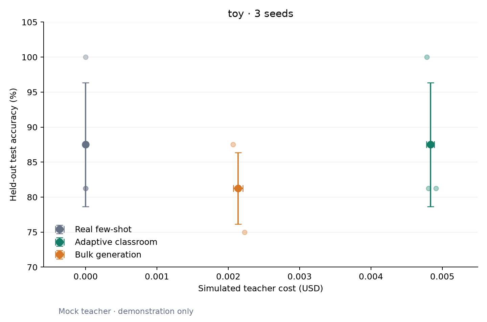

# Reproduce an example and export a report

Run these commands from the repository root after creating and activating a
Python 3.10+ virtual environment:

~~~bash
python -m pip install -e ".[dev,report]"
homeroom demo
~~~

If the environment was created with uv and has no pip, use
~~~bash
uv pip install -e ".[dev,report]"
~~~
for installation instead.

The demo uses the built-in toy dataset, a mock teacher, and a TF-IDF student.
It requires no API key, network access, or GPU after installation. It runs
real_fewshot, classroom, and bulk with seeds 0, 1, and 2.

Outputs are written to results/toy_demo_dryrun/:

| File | Contents |
|---|---|
| report.md | Metrics, paired seed comparisons, costs, and provenance |
| report.json | Unrounded aggregates and source file SHA-256 hashes |
| accuracy_vs_spend.png | Chart for the report and GitHub |
| accuracy_vs_spend.svg | Vector chart for export |
| ARM_seedN.json | Per-run measurements and resolved configuration |
| summary.md | Compact legacy results table |

The demo results and cache are local artifacts and are gitignored. Re-running
the demo reuses its saved results. To intentionally regenerate the runs:

~~~bash
homeroom run --config configs/toy_demo.yaml --force
homeroom report --config configs/toy_demo.yaml
~~~

## Example chart

This chart demonstrates the report format. Mock accuracy and simulated costs
provide no evidence about Banking77, model quality, or actual spending.

## Report an experiment

~~~bash
homeroom report --config configs/YOUR_EXPERIMENT.yaml
~~~

Reporting reads result JSON only; it never loads the official test data, trains
a student, or calls a teacher. It requires every arm and seed declared in the
config to be present. Extra result files are ignored. Missing seeds, changed
scientific settings, mismatched bulk caps, and invalid metrics cause an error
instead of a misleading report.

Each arm has one large mean marker plus faint individual seed points. Error
bars show one population standard deviation in accuracy and teacher spend,
using ddof=0 to match the existing summaries. These are not confidence intervals
or evidence of statistical significance. The figure compares arms at their
realized spending; it does not represent a sweep over budgets.

The paired table shows classroom minus bulk accuracy for the same seed and the
bulk underspend. Bulk's cap equals classroom's realized spend; its actual cost
can be lower because the next request cannot fit under the remaining cap.

## Interpret costs

| Teacher source | Report label | Interpretation |
|---|---|---|
| Mock | Simulated teacher cost | Orchestration only; no provider bill |
| Queue / teacher agent | Estimated API-equivalent teacher cost | Character-based token estimate; excludes thinking and subscription costs |
| API | Teacher cost from API token usage | Usage multiplied by configured prices; reconcile with the provider bill |

In historical queue runs, real_spent_usd means uncached accounted usage; it does
not establish actual spending. Report labels come from the provider, so an
estimated run cannot become API-billed evidence just because this field is
nonzero. Student training and hardware costs are excluded from the teacher-cost
comparison.

Changing the teacher model starts a separate experiment. Keep model names,
token prices, prompts, seed draws, student settings, and cost provenance with
the results. Never combine different teacher models into one three-seed mean.
